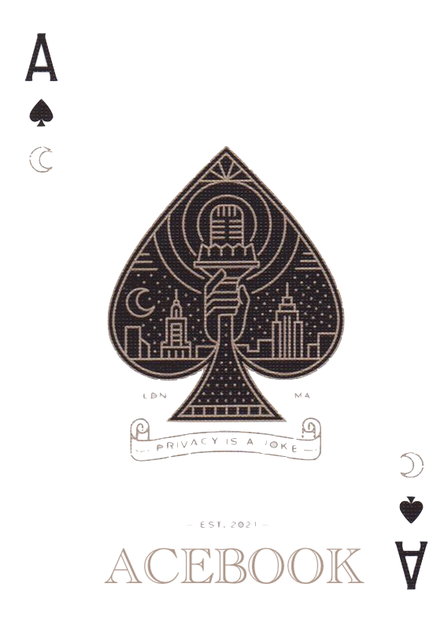

AceBook
==================

<div align="left"> 
 </a> 
<div>
  
______
  
[Planning](#Planning) | [Set up](#Setup) | [DB Connection](#DB) | [Interact](#Interact) | [Run Tests](#Tests) | [User Stories](#User-Stories) | [Technologies](#Tech)

This project is a simple Facebook clone. Users can signup with an optional profile picture, login, make posts (with images), like/dislike and comment on posts, search all posts for specific content, and view their own profile page.\
This app is deployed on [Heroku](https://whispering-woodland-40745.herokuapp.com/).

In this project we learned and implemented the following techniques:

- Introduction to Ruby on Rails & Active Record
- Agile Methology for user stories & domain modeling
- Feature and Unit testing
- GET / POST requests - defining routes
- Creating Tickets & using Trello
- Run stand-ups and retrospectives
- Use a branch/PR/merge git workflow

## Team members

- [Fiona Apps](https://github.com/oddpotato)
- [Yousuf Mohamed](https://github.com/yousufmohamed17)
- [Graeme Stirling](https://github.com/gjstirling)
- [Nicola Carroll](https://github.com/Nicola-Carroll)
- [Suhani Zaman](https://github.com/suhani-zaman)
- [Corinne Bösch](https://github.com/CorinneBosch)

## <a name="Planning">Planning & Domain Model</a>


  
## <a name="Setup">Set up</a>

1. **Fork** this [Acebook repository](https://github.com/CorinneBosch/acebook/) 
2. Then clone **your** fork to your computer.
3. Ensure you have `Ruby` and `rspec` installed. Check ruby version with `ruby -v`
4. Ensure you have Node.js installed on your machine as the JavaScript runtime. Check node version with node -v
5. Install bundler if you haven't already. `gem install bundler`
6. Install the gems required by this repository. `bundle install`

## <a name="DB">DB Connection</a>

Before running the application on localhost, please migrate the database.\
If you wish to seed your db you can do so with the 2nd command.

```
rake db:migrate
rake db:seed
```
  
## <a name="Interact">Interact with the programme</a>

Open the application in your directory with `rails server`

Direct in your browser to `http://localhost:3000`.\
Now you can register on Acebook and browse through the super interesting feed and like away!

## <a name="Tests">Run tests</a>

To test all units and features at once in your terminal.\
Print out the format documentation with the -fd shortcut.
```
$ rspec
$ rspec -fd
```

To test inividual controller or feature tests in your terminal:
```
$ rspec spec/controllers/posts_controller_spec.rb -fd
$ rspec spec/features/user_can_login.rb -fd
```

## <a name="User-Stories">User stories & criteria</a>

Find all user stories & tickets on this [Trello Board](https://trello.com/b/aN3xtXXl/acebook-rails-template).\
The Acebook project criterias can be found [here](https://github.com/makersacademy/course/blob/main/final_projects/project_criteria.md).
 
## <a name="Tech">Technologies used</a>
  
- Framework: Ruby on Rails
- Database tools/ORM: ActiveRecord, ActiveStorage
- Testing: RSpec and Capybara
- Linting: Rubocop
- Deployment: Heroku
- Business tools: Miro, Trello, EasyRetro
- Other: jQuery
